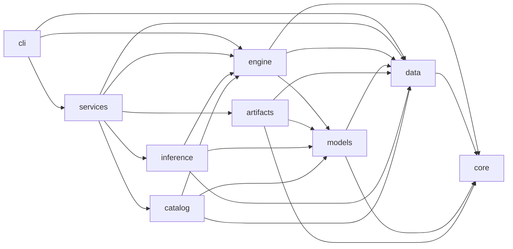

# SER-lib 核心库边界审计与瘦身计划

审计日期：2026-09-09。源码基线：本地 `main`，提交 `77ce0edc7b2cf714fb506db1d4d8639e8dbc286d`，包版本 `0.2.0`。开始审计时工作区干净；没有切换分支、修改实现、安装依赖或运行重构。

本文是待人工确认的设计与实施计划，不表示重构已经完成。用户提供的提示词作为本次文档的需求材料；其中目标目录、示例名称和待检查文件不是当前源码事实。本文区分**源码事实、审计判断、拟议 API、未来验收**。审计范围是本地 main，不声称已核验远端 main 或线上发布状态。

配套证据：[完整模块、配置、导出、依赖与调用清单](SER_LIB_CORE_BOUNDARY_EVIDENCE.md)。该附录是本文组成部分，包含逐文件决策、静态 import 边、公开符号及调用位置。正文给出需要人工判断的职责边界和执行顺序。源码路径均相对于仓库根目录；附录源码链接带基线行号。

## 1. Executive Summary

结论是**收缩应用包装，保留完整 SER 能力，并扩展现有模型契约**，不是推倒重建。

1. `core/` 必须拆解。配置移入 `config/`，格式迁移回归格式所属领域；foundation 只留下异常、诊断、通用事件和显式日志辅助。
2. 七个 Service 均应退役，但必须先接回其中的 lineage 注入、预测器构造和落盘便利行为。`TrainingService.run()` 确实是 `fit()` 加 `last_result` 包装，直接改善 `Trainer.fit()` 返回值。
3. `RecordView/RecordPage`、`TrainingRunDetail`、`EvaluationRunDetail`、`EvaluationPredictionPage` 是明确的包装退役对象。数据过滤、预测记录流式读取、训练记录、报告、扫描失败信息不能随之删除。
4. `engine/` 是必要核心。当前两个名为 Trainer 的类是公开子类与内部实现的继承链，只有一套训练循环，不能误报为两套训练系统。当前评估入口是函数 `evaluate()`，**没有 `Evaluator` 类**；不为满足提示词示意图而新增包装类。
5. 现有 `HFAudioClassifier` 已支持可选加载、waveform、mask、分类头、冻结和离线架构重建。主要差距是通用 Torch 包装、真实 HF 架构适配、processor 持久化、完整能力声明和真实依赖集成测试。
6. 基础安装已经不要求 transformers；`safetensors` 是现有 artifact v2 的直接依赖，应保留。`pretrained` extra 的 `transformers>=4.38,<6` 跨度大，现有 fake 测试不能证明整个版本范围兼容。
7. 不按“有 JSON 序列化方法”删除类型。`TrainingResult`、`PredictionResult`、`Diagnostic`、`ModelCard`、`ModelArtifactManifest` 都描述真实领域概念。

最高风险：配置搬迁后反向 import；删除 Service 时丢失训练 lineage；Adapter 包装改变 state_dict 键；HF processor 缺失导致离线推理不一致；只更新目录却遗漏 coverage/API/示例。先消除这些风险再删除旧目录。

## 2. SER-lib 最终定位

`ser_lib` 是 Speech Emotion Recognition Core Library / Python SDK，提供数据准备、表示、模型构建、训练、评估、推理、checkpoint 和可移植 artifact。所谓“纯 Python”指用户接口和职责边界，不意味着移除 PyTorch、SoundFile 等具有原生实现的数值依赖。

审计准入问题：如果永远没有 Web、Desktop、GUI，该能力是否仍对 Python 用户有明确价值？批处理、PCM streaming、取消、日志、实验历史、数据编辑和资源诊断的答案是“是”；页面首屏、跨领域详情组合、浏览器分页的答案是“否”。上层应用自行建立 Service、传输模型、Job、鉴权、HTTP 和页面，不由本库预留这些接口。

## 3. 现有目录结构

```text
ser_lib/
  __init__.py                 # 广泛重导出
  benchmark.py               # 基准运行/比较
  catalog.py                 # 跨领域组件描述聚合
  runtime.py                 # 设备能力与 CPU/RAM/GPU 按需快照
  core/                      # config、异常、事件、日志、迁移、扫描控制流
  data/                      # 数据/配置/查询/分析/编辑/修订/注册
    importers/               # 9 个具体 importer + 共享 conversion
    representations/         # waveform、spectral、acoustic、composite
    transforms/              # waveform、feature
  models/                    # SERModel、registry、CNN/GRU/Transformer、pretrained
  engine/                    # 训练、评估、配置、目标、优化器、记录/报告/详情/扫描
  inference/                 # offline、batch、streaming
  artifacts/                 # manifest、exporter、loader、catalog
  services/                  # 7 个 facade
  cli/                       # main、workflows、__main__
```

没有实际 `dto/`、`views/`、`web/`、`desktop/` 目录；边界泄漏嵌在现有模块中。`.gitignore` 的 `artifacts/` 规则会让普通 `rg --files` 漏掉已跟踪的 `ser_lib/artifacts/*.py`，因此完整性以 `git ls-files` 为准。

## 4. 当前架构问题

| 问题 | 源码证据 | 影响 | 决策 |
|---|---|---|---|
| 配置定义分散 | `core/config.py`、`engine/config.py`、`engine/optim.py`、`models/*`、data 子模块 | 默认值、校验、JSON schema 来源分裂 | 所有内置用户 schema 归中央 config |
| 重复 Audio 配置 | `AudioSettings` 与 `AudioLoaderConfig` 四字段相同 | Python 与 YAML 路径校验差异 | 合并为 `config.data.AudioConfig`，保持旧 payload 语义 |
| facade 掩盖返回值 | `services/training.py:TrainingService.run` | 调用方依赖两步结果获取 | `Trainer.fit -> TrainingResult` |
| CLI 承担可复用实验流程 | `cli/workflows.py:train_experiment/evaluate_artifact` | Notebook 无法自然复用，或被迫 import CLI | 提炼 engine 实验执行函数，CLI 保留参数与输出适配 |
| 页面包装进入领域导出 | 根包与 engine 导出 RunDetail/Page | 核心 API 被产品消费结构牵制 | 先替换调用后移除 |
| ModelSpec 属于 data | `models/base.py -> data.validation.ModelSpec` | 模型概念归属错误，迁移易成环 | ModelSpec 回归 models，跨域校验回归 engine |
| 组件 Catalog 重复描述转换 | `catalog.py:_model_descriptors` | ModelDescriptor 转为另一描述类型 | 各领域 registry 原生 introspection，删除聚合层 |
| 顶层 import 过重 | 根包导入多数 package，artifact 再读根包版本 | 初始化顺序脆弱 | 缩减根导出；独立 `_version.py` |
| 推理/评估依赖 Trainer helper | `inference/offline.py:12`、`engine/evaluator.py:24` import `move_batch_to_device` | 推理被迫加载训练模块，评估与训练形成静态回边 | helper 归 `data/types.py`，所有消费者同源使用 |
| HF 适配假设过强 | `models/pretrained.py:forward` | 所有模型被当作 input_values + last_hidden_state | 按输入/输出家族小策略适配 |

没有发现库中真实 HTTP 服务器、鉴权或后台 Job 系统；不可将注释中的 Web 或 Worker 一律判成运行时依赖。

## 5. Core / Foundation 专项审计

| 当前文件 | 职责与判断 | 最终处理 | 目标 |
|---|---|---|---|
| `core/config.py` | StrictConfig、YAML、路径、schema 入口，是真配置基础 | 拆分 | `config/base.py`、`config/loader.py` |
| `core/exceptions.py` | SERError、ConfigurationError、SchemaMigrationError、OperationCancelled | 迁移 | `foundation/errors.py` |
| `core/diagnostics.py` | 结构化错误与建议，CLI/SDK 均有价值 | 迁移 | `foundation/diagnostics.py`；移除 UI 导向表述 |
| `core/events.py` | 通用事件与 checkpoint/prediction 领域事件混居 | 拆分 | 通用事件/取消留 `foundation/events.py`；领域事件分别入 `engine/events.py`、`inference/events.py` |
| `core/logging.py` | 显式添加 handler，无需产品层 | 迁移 | `foundation/logging.py`；仍不得配置 root logger |
| `core/migrations.py` | 通用注册器承接 dataset、run、revision、experiment 等域 | 拆分 | `config/migrations.py`、`data/migrations.py`、`engine/migrations.py`、`artifacts/migrations.py` |
| `core/_catalog_scan.py` | 通用遍历却以 Catalog candidate/failure 协议组织 | 拆分 | 领域私有扫描循环；保留取消/错误策略测试，不进入 foundation |
| `core/__init__.py` | 重导出旧路径 | 删除 | 更新消费者后删除整个 core |

迁移注册器目前提供机制，并不等于已存在完整的内置跨版本迁移链；必须保留 `tests/test_schema_migrations.py` 中的缺链、坏版本和只读迁移行为。artifact v1 使用显式 legacy defaults 和版本门禁，不能虚构 SHA256 字段把 v1 伪装成 v2。checkpoint 当前独立使用 `format_version`，不能强套 `schema_version`。

不把所有“通用”函数搬进 foundation：扫描代码允许少量领域内重复，以避免重新引入跨领域应用框架。`LibraryEvent` 在 foundation 仅表达基础事件，领域事件通过结构化事件协议被 callback 接收；foundation 不 import engine/inference 来拼联合类型。事件 schema 中仍具算法意义的 run_id、split、step、sample uid 保留。

## 6. Config 专项审计

附录逐个列出配置类及行号，覆盖 importer、representation、transform 的内嵌 schema，不仅搜索文件名 `config.py`。

| 当前类型/族 | 当前路径 | 用户配置？ | 目标 |
|---|---|---|---|
| StrictConfig / _StrictModel | `core/config.py`、`data/config.py` | 基类 | `config/base.py`，合并无行为子类 |
| DataConfig、ComponentConfig、BatchingConfig、FixedBatching、SlidingBatching | `data/config.py` | 是 | `config/data.py` |
| AudioSettings、AudioLoaderConfig | `data/config.py`、`data/audio.py` | 是；“运行时配置”注释不改变性质 | 合并 `config/data.py:AudioConfig` |
| CacheSettings | `data/config.py` | 是 | `config/data.py:CacheConfig` |
| ModelConfig、CNNBaselineConfig、GRUBaselineConfig、TransformerBaselineConfig | `engine/config.py`、`models/*_models.py` | 是 | `config/model.py` |
| HFAudioClassifierConfig | `models/pretrained.py` | 是 | `config/model.py`，定义不 import transformers |
| TrainerConfig、ObservabilityConfig | `engine/config.py` | 是 | `config/training.py` |
| ExperimentConfig | `engine/config.py` | 是 | `config/experiment.py` |
| AdamWConfig、AdamConfig、SGDConfig、OptimizerConfig 联合别名 | `engine/optim.py` | 是 | `config/optimizer.py` |
| StepSchedulerConfig、CosineSchedulerConfig、SchedulerConfig 联合别名 | `engine/optim.py` | 是 | `config/scheduler.py` |
| LossConfig、SamplingConfig | `engine/objectives.py` | 是 | `config/training.py`；计算留 engine |
| StreamingConfig | `inference/streaming.py` | 是 | `config/inference.py`，保留当前默认值和约束 |
| 九类 ImportConfig | `data/importers/*.py` | 是 | `config/importers.py` |
| RawWaveformConfig、SpectralConfigBase 及其四类子配置、AcousticFeaturesConfig、CompositeConfig | `data/representations/*.py` | 是 | `config/representations.py` |
| NormalizeConfig、GaussianNoiseConfig、TimeShiftConfig、VolumeScaleConfig、PitchShiftConfig、TimeStretchConfig、SpecMaskingConfig | `data/transforms/*.py` | 是 | `config/transforms.py` |
| ExperimentPresetInfo / Catalog、PresetStatus | `engine/presets.py` | 预设描述，而非独立配置 schema | 模板构建进 `config/presets.py`；去掉选择器聚合包装 |
| ModelCard、ModelArtifactManifest | `artifacts/manifest.py` | 否，领域 metadata；虽继承 StrictConfig | 保留 artifacts，改为领域自身严格 BaseModel 策略 |
| ManifestMeta、_RunRecordModel、_EvaluationRunRecordModel、_RevisionRecordModel、_EpochResultModel 等 | manifest/run/history/report 模块 | 否，持久化 schema | 留格式所属领域 |
| ExperimentComponents | `engine/config.py` | 否，model/loader/pipeline/collator 实例 | `engine/experiment.py` |
| TensorSpec、ModelSpec、ModelOutput、RuntimeMetrics、StreamingLatency | 各领域 | 否，契约、结果或测量值 | 留所属领域；ModelSpec 迁 models |

配置遗漏不只来自类：CLI 的 batch_size/workers/split、推理 device/window_aggregation/fail_fast、评估 retain_predictions、profile histogram_bins 都是用户选项。拟建立 `DataLoaderConfig`（config/data）、`EvaluationConfig`（config/evaluation）、`InferenceConfig/BatchInferenceConfig`（config/inference），将可复现实验选项纳入快照。Python API 可继续提供便捷关键字参数，但默认值和验证只取中央定义，不复制另一套 schema。路径 destination、单次 uid、callback、sink、cancellation 是操作输入/依赖，不机械包装为配置。profile 的 histogram_bins 等小参数由中央 data 分析选项定义，避免造一文件一类型。

`ModelConfig.params` 保留插件可扩展性；本库内置 schema 全部中央化。第三方插件的自有 schema 仍在其发行包内，通过唯一 model registry 提供，不能为满足中央化而把未安装插件代码塞进本库。

加载器统一 YAML 和相对路径策略：输入 manifest、cache.directory、output_dir、checkpoint_dir 以及外部模型本地路径必须明确基准目录。当前 `load_data_config` 与 `load_experiment_config` 的迁移/路径处理不完全相同，迁移时先锁定旧配置解释结果，再消除不一致。远程 repo ID 不能当本地相对路径 resolve。

`config/experiment.py` 不能继续 lazy import `engine.optim` 做 validator；解析器和类型判别一并迁入 config，只有构造 torch optimizer/scheduler 留 engine。`build_experiment_components` 绝不能跟着 ExperimentConfig 搬进 config。

## 7. Services 专项审计

| Service | 转发/重复/应用职责判断 | 必须接回的能力与替代 API | 主要调用与测试 | 最终处理 |
|---|---|---|---|---|
| DatasetService | 大部分直接转发；query 返回 Page，detailed_profile 面向分析页 | DatasetManifest、DatasetEditor、fingerprint/profile/revision 原函数；query 改 `iter_records` | `tests/test_services.py`、dataset 系列测试 | 删除 |
| TrainingService | validate/inspect/scan 转发；run 包装 fit；create_trainer 注入 lineage；detail 真聚合 | `Trainer.from_experiment(..., dataset_id, dataset_fingerprint)`；`fit -> TrainingResult`；run 读写回 engine | `cli/workflows.py`、`test_training_result.py`、`test_training_lineage.py`、`test_training_run_detail.py` | 删除 |
| EvaluationService | run 直接 evaluate；save_run 写后读；detail 组合报告/文件 stat/diagnostic | 保留 `evaluate`、metadata builder、run writer/loader；library_version 默认值归 builder | `cli/workflows.py`、evaluation run/detail/report 测试 | 删除 |
| InferenceService | 单条转发；批量包装 BatchEmotionPredictor；构造 LoadedArtifact 解包有价值 | `EmotionPredictor.from_loaded_artifact`（拟议）；现有 batch 方法与 writer；StreamingEmotionRecognizer | `cli/workflows.py`、`test_services.py`、batch/streaming 测试 | 删除 |
| ArtifactService | scan/inspect/verify/load 直接转发；export 注入 source_run 元数据 | exporter 接收通用 provenance metadata；engine 导出 helper 将 TrainingRunMetadata 转换，不让 artifacts import engine | `export_checkpoint_artifact`、artifact/service/lineage 测试 | 删除 |
| CatalogService | snapshot/list/get 是聚合转发；面向动态表单/向导 | registry 的 names/descriptor；`config.presets.build_experiment_config` | `test_service_catalog_presets.py`、`test_component_catalog.py` | 删除 |
| RuntimeService | capabilities/metrics 两个纯转发，无后台轮询 | `get_runtime_capabilities/get_runtime_metrics` 迁 `engine/runtime.py` | `test_services.py`、runtime 系列 | 删除 |

七个 Service 都承担历史应用隔离；并非每个都重复 CLI 的全部流程。真正重复是转发层、结果二次读取和 config/组件校验；训练循环没有复制。退役顺序：接回真实能力 → 内部调用 → CLI → 测试与文档 → 确认 import 和字符串引用归零 → 删除 facade。不得先删后修。

## 8. CLI 与 Service 重复分析

`cli/main.py` 负责 argparse、importer、dataset 与 component 命令；`cli/workflows.py` import 四个 Service，同时直接 import data/engine。不是所有 CLI 命令都经过 Service。

| 当前函数 | 已确认行为 | 迁移方案 |
|---|---|---|
| `_loader` | 构造 SERDataset、weighted sampler、DataLoader | 数据 batch 构造 helper 留 data；sampling 计算留 engine，作为输入注入 |
| `train_experiment` | 配置默认输出、构建模型/数据、fingerprint、validation batches、resume、fit、写 metrics/history/run | 复用实验执行进 `engine/experiment.py:run_experiment`；CLI 只解析和序列化返回 |
| validation 分支 | 再调用 `build_experiment_components(config, train=False)`，生成第二个模型但只用其 data 组件 | 用 `data.build_components(..., train=False)` 构建验证数据，不重复加载模型；属于源码可见成本，不声称已测时 |
| `evaluate_artifact` | load artifact、manifest、fingerprint、metadata、evaluate、report/run | load 在 CLI 入口完成；执行/保存数据与模型评估进 engine，engine 不反向 import artifacts |
| `predict_artifact` | load、构造 predictor、目录/manifest/文件来源分派、写结果 | 直接调用 artifacts + inference public API；来源分派是合理 command adapter |
| `export_checkpoint_artifact` | 重建组件、load checkpoint、解析 source_run、export | checkpoint 到 provenance 转换留 engine helper；CLI 调 exporter；跨域流程不伪装成通用 Service |
| `inspect_artifact` | inspect/verify 二选一并 model_dump | 可直接 inline 为 CLI 适配 |

`fit()` 改返回结果后，CLI 用 `result.epochs` 写历史，不再读取 last_result 作为成功返回主路径。异常/取消的 last_result 可保留为运行状态诊断入口，不能因返回值改变丢掉失败结果。run writer 返回 Path 还是 Info 应统一选定；建议保持底层 writer 的 Path，调用者只有确需规范记录时才 read，消除盲目写后读。

## 9. DTO / View / Page 专项审计

| 符号 | 实际内容/调用依据 | 处理 |
|---|---|---|
| `data.query.RecordView` | 复制 AudioRecord，并把 Path 和 metadata 改成传输形式；DatasetService.query 使用 | 删除；直接产出 AudioRecord |
| `data.query.RecordPage` | items/total/offset/limit/has_more | 删除；调用者自行 islice/分页 |
| `query_records` | 过滤算法与分页/传输绑定 | 重构为 `iter_records`；保留 split/label/speaker 过滤，keyword 规则显式化 |
| `engine.runs.TrainingRunDetail` | run.json + history.json + checkpoint stat，TrainingService 聚合 | 删除；上层分别调用三个 API |
| `engine.evaluation_detail.EvaluationRunDetail` | evaluation.json + report + predictions 文件信息，Service 聚合 | 删除 |
| `EvaluationPredictionFileInfo` | path/exists/size_bytes 的真实文件 metadata | 合并到 `evaluation_reports.py`；可保留 stat helper，不能绑定 Detail |
| `EvaluationPredictionPage` | source_file/offset/limit/matched_count/next_offset | 删除；流式 `iter_evaluation_predictions` 返回 PredictionRecord |
| `catalog.ComponentCatalog` | 模型、数据、训练配置统一包装 | 删除；领域 registry 自身描述保留 |
| `ArtifactInfo` | 大量重复 Manifest 字段，并夹带管理列表 ID/容量聚合 | 瘦身：返回原 ModelArtifactManifest 与最小路径/文件 stat，不复制完整 metadata |
| `DatasetSummary/DatasetProfile` | 一部分首屏命名，但 split/label/speaker/时长统计为真实分析 | 合并共同统计实现；保留领域分析结果，移除 label_display_names 等展示派生值 |
| `ImportPreview` | scan 在写数据前给出记录数与 diagnostics | 保留；是导入预检结果 |
| `ExperimentValidationResult` | diagnostics、normalized_config、summary | 瘦身 summary 中重复可推导字段，保留预检结果 |

关键词扫描还会命中 Diagnostic/Event/TrainingResult 的注释及 `to_dict/to_json_safe`；这些命中是线索，不是删除证据。完整命中附录保留路径和上下文。没有 HTTP Response 类就不发明 Response 退役任务。

## 10. Data 专项审计

| 模块 | 核心价值与当前问题 | 最终处理 |
|---|---|---|
| audio | probe/decode/segment/resample，SoundFile 回退；两套 Audio 配置 | 拆分 |
| dataset / types | SERDataset、AudioRecord、AudioData、SERBatch、TensorSpec；真实数据契约 | 保留 |
| manifest | meta/record 读取、验证、路径、schema 迁移入口 | 瘦身 |
| collate | dynamic/fixed/sliding、lengths/masks；核心 | 保留 |
| pipeline | train/eval 表示和变换构造；核心 | 保留 |
| cache | 确定性表示磁盘缓存 | 保留 |
| validation | 模型输入兼容、报告；跨域归属混杂 | 迁移 |
| query | 通用过滤 + RecordView/Page | 重构 |
| profiling | 音频 header/标签/split/speaker 分析混合展示字段 | 瘦身 |
| fingerprint | dataset.yaml 和 split 清单 hash，不是全量音频 hash | 保留 |
| editor | staging、乐观并发、原子替换/恢复；真实程序化编辑 | 保留 |
| history | manifest revision、hash、事务 restore；不复制音频 | 保留 |
| registry | namespaces 区分 importer/representation/transforms | 保留 |
| errors | 数据领域异常；RegistryError 被 models 跨域使用 | 拆分 |
| importers | CSV/JSONL/folder/CASIA/CREMA-D/CSEMOTIONS/EmotionTalk/ESD/RAVDESS | 拆分 |
| representations | 原始波形、谱/MFCC、声学特征、组合；配置内嵌 | 拆分 |
| transforms | 波形增强/SpecMasking、概率包装；配置内嵌 | 拆分 |

这里“拆分 importer/representation/transform”只指 schema 搬迁，算法与注册保持原域，不重新设计一套数据 pipeline。`DatasetRevisionInfo/Catalog` 保留真实修订元数据和扫描失败信息；没有页码模型，不因 History 名字删除。音频内容未被 revision 备份的限制必须继续明确。

`TensorSpec` 继续在 data；`ModelSpec` 移 models；`inspect_compatibility/validate_compatibility` 移 engine。data 只验证自身数据格式，不 import engine/models。artifacts 可调用 engine 的纯兼容校验，不要求 engine 调回 artifacts。

`_trainer_core.py:move_batch_to_device` 只对 SERBatch 的张量执行设备迁移并保留 metadata，应归 `data/types.py`（或后续确有需要再拆 batch 工具文件）。训练、评估、推理都从 data 获取它，消除 inference→trainer 和 evaluator→trainer 的辅助函数依赖。`RegistryError` 移 foundation 时重新确认 `SERDataError` 捕获者的兼容策略，不能悄悄改变异常继承导致旧处理分支失效。

## 11. Engine 专项审计

A=核心训练；B=核心评估；C=checkpoint；D=SDK 辅助；E=应用层；F=页面支持；G=历史兼容；H=冗余包装。

| 文件 | 分类及具体证据 | 最终处理 |
|---|---|---|
| trainer.py | A/C：公开 Trainer 继承内部 Trainer，补默认 optimizer、lineage、resume | 合并 |
| _trainer_core.py | A/B/C：唯一 fit/train_epoch、AMP、累积、裁剪、评估调用、保存恢复、结果 | 合并 |
| evaluator.py | B：evaluate、ClassMetrics、PredictionRecord、sink、report writer | 保留 |
| checkpoint.py | C/G：v1/v2、模型/optimizer/scheduler/scaler/RNG/config | 保留 |
| checkpoint_catalog.py | C/D：只 stat，不 torch.load；分类 epoch 来自文件名 | 保留 |
| runs.py | D/F：持久化 TrainingRunInfo、扫描，同时定义页面 Detail | 拆分 |
| evaluation_runs.py | B/D：EvaluationRunMetadata/Info、读写 evaluation.json | 保留 |
| evaluation_reports.py | B/F：report 检查、PredictionRecord 校验与 Page | 拆分 |
| evaluation_detail.py | D/F：文件 stat + 页面聚合 | 拆分 |
| evaluation_catalog.py | B/D：只读 evaluation.json 扫描，错误隔离 | 保留 |
| lineage.py | A/D：run_id、dataset fingerprint、config digest、设备/seed | 保留 |
| training_history.py | A/D：历史 epoch 结果读取校验 | 保留 |
| eta.py | D：估时/阶段进度，CLI 和长训练有价值 | 保留 |
| objectives.py | A：ClassificationLoss/weighted sampler + 用户配置 | 拆分 |
| optim.py | A：白名单 parse/build optimizer/scheduler + 用户配置 | 拆分 |
| validation.py | A/B/D：静态 ModelSpec、manifest、设备、配置兼容检查 | 瘦身 |
| config.py | 配置 + 构造函数 + runtime components | 拆分 |
| presets.py | D/E：可复现实验模板与 catalog 包装 | 迁移 |
| __init__.py | 大量 Config/Detail/Page 重导出 | 瘦身 |

合并 Trainer 时保留单一公开类和全部行为测试；不是强求一个巨型文件。`EpochResult/TrainingResult/TrainingStatus` 可进 `engine/state.py`，loop 可保留一个私有辅助文件，但不再保留同名内部基类带来的“两个 Trainer”认知成本。

`runs` 和 `evaluation_catalog` 扫描真实实验记录，是脚本批量选实验的合理能力。保留稳定的排序、fail_fast、取消、不加载模型/权重边界；不添加详情页一次性读取能力。

## 12. Artifact / Checkpoint 专项审计

保留 `export_model_artifact`、`inspect_model_artifact`、`verify_model_artifact`、`load_model_artifact`、`ModelArtifactManifest`、`ModelCard`、`LoadedArtifact`。导出采用 staging 后提交，safetensors、SHA256 和配置/标签一致性是模型分发核心。

`artifacts/catalog.py` 的扫描算法有 Python 价值，但 `ArtifactInfo` 复制 manifest 较多。拟返回最小 `ArtifactEntry(path, manifest, weights_bytes)` 与失败集合；总目录容量、展示别名、flatten metadata 留应用层。既有 `scan_model_artifacts` 名称可保留，返回类型变更列入版本说明。scan 仍只 inspect/stat，verify 才 hash，load 才实例化模型。

`checkpoint_catalog.inspect_checkpoint_file` 不读 checkpoint 内容，因此不能用它声明模型兼容或可信性；文件名推导的 epoch 不是 payload epoch。继续保留此低成本工具。

持久化兼容矩阵：

| 格式 | 当前实现 | 迁移原则 |
|---|---|---|
| artifact v1 | legacy defaults、显式 allow_legacy_pickle、weights_only=True | 保留真实旧格式；不静默升级完整性承诺 |
| artifact v2 | safetensors、多文件 hash、manifest 对照 | 保持可读；新增 processor 文件需明确 manifest 扩展/版本策略 |
| checkpoint v1/v2 | trusted pickle；v2 额外恢复 RNG 等 | 路径改名不更改格式；Adapter state 键变更必须转换或拒绝 |
| dataset / revision / run / evaluation | 领域 schema_version 与迁移入口 | 只读迁移，不回写用户源文件；缺链/未来版本明确失败 |
| history / metrics / predictions | 各自读取校验 schema | 保留旧数据读取；Page 删除不删除 JSONL |

HF 现有 artifact round-trip 用 fake encoder；未来需新增真实 tiny 模型的 train→export→离线 load→predict→checkpoint resume 全链路。外部 Python 代码不打包为可执行 pickle；通过注册 ID 重建，缺插件明确报错。

## 13. Public API 审计

根包、各一级包和所有 `__all__` 的逐符号清单见附录。没有 `__all__` 的模块中无下划线顶层定义与导入仍可能被使用；它们列为直接模块 API 风险，不以“未导出”自动认定无人调用。

| Public API | 当前来源 | 是否保留 | 新 API / 行为 |
|---|---|---|---|
| 七个 *Service | `ser_lib.services` | 否 | 第 7 节领域入口；根包本来就未导出 Service |
| StrictConfig / config loaders | `ser_lib.core`、各 config 模块 | 是 | `ser_lib.config` |
| ExperimentConfig / TrainerConfig / ObservabilityConfig / ModelConfig | 根包、engine | 是 | `ser_lib.config` 为唯一规范入口 |
| data、model、optimizer、scheduler、loss、streaming 配置 | 各子域 | 是 | 中央 config；旧代码路径阶段性删除 |
| Trainer | 根包、engine | 是 | `ser_lib.engine.Trainer`；fit 返回 TrainingResult |
| evaluate / EvaluationResult | engine；evaluate 也根导出 | 是 | `ser_lib.engine`；不新增 Evaluator facade |
| EmotionPredictor / BatchEmotionPredictor / StreamingEmotionRecognizer | inference / 根包 | 是 | 保留；增加 from_loaded_artifact 便利构造 |
| SERModel / ModelOutput / native models | models / 根包 | 是 | 保留；可用 TorchModelAdapter 包装普通 nn.Module |
| HFAudioClassifier | models / 根包 | 是 | 底层迁 adapters/huggingface；注册 ID 保留 |
| RecordView / RecordPage / query_records | data | 否/替换 | `data.iter_records -> Iterator[AudioRecord]` |
| TrainingRunDetail / EvaluationRunDetail | engine / 根包 | 否 | 分别读取真实记录、history、report、stat |
| EvaluationPredictionPage / query_evaluation_predictions | engine / 根包 | 否/替换 | `iter_evaluation_predictions -> Iterator[PredictionRecord]` |
| ModelSpec / inspect_compatibility | data；部分根导出 | 是 | ModelSpec 到 models；兼容校验到 engine |
| ArtifactCatalog / ArtifactInfo | artifacts / 根包 | 瘦身 | 扫描保留，最小 ArtifactEntry 替代重复字段 |
| TrainingRunCatalog / EvaluationRunCatalog / CheckpointCatalog | engine / 根包 | 是 | 实验/文件扫描结果，无页面对象 |
| ComponentCatalog / get_component_catalog / list_component_descriptors | catalog / 根包 | 否 | 领域 registry introspection |
| DatasetProfile / DatasetSummary | data | 合并 | 领域分析结果，展示名调用方从 labels 读取 |
| schema migration 全局注册 API | core | 不原样保留 | 按领域 migration API，不能永久保留 global facade |
| runtime 查询 | runtime / 根包 | 是 | `engine.runtime` 与 engine 公共入口 |
| benchmark API | benchmark 模块 | 是 | `engine.benchmark`；用于 SER 性能诊断 |

根包最终只保留版本与少量高频 SDK 便利导出（Trainer、SERDataset、SERBatch、SERModel、ModelOutput、EmotionPredictor）。规范文档统一使用一级领域入口。顶层导出收缩是代码 API 变更，必须在 changelog 列全清单，不能假装无兼容成本。

保留的重型便利导出需惰性解析，或彻底取消重导出；不能仍在根包顶层导入 Trainer/models。Python 导入 `ser_lib.config` 会先执行根 `__init__`，因此只有先处理根初始化，才能兑现“配置加载不导入 torch/transformers”的目标。

## 14. Dependency Graph

下图箭头表示“左侧 import/调用右侧”，不是数据流。



目标允许图：

```text
foundation -> 标准库
config -> foundation、Pydantic、YAML、标准库
data -> config、foundation、数据数值依赖
models -> data.types、config、foundation、torch；HF 只在 adapter 实例化时可选导入
engine -> data、models、config、foundation
inference -> data、models、config、foundation；构造 artifact 时仅局部依赖 artifacts
artifacts -> data、models、config、foundation、engine.compatibility（纯校验）
cli -> 各一级 public Python API
```

engine 不 import artifacts：实验执行接受模型/数据组件；artifact 装载与导出入口负责组合。inference 的 from_loaded_artifact 接受已经装载对象，可通过 TYPE_CHECKING 或最小结构协议避免运行时反向依赖。artifact 不 import inference。版本取 `_version.py`，而不是回根包。

完整静态边在附录，包括函数内导入与 TYPE_CHECKING 标识；AST 图是静态依赖上界，不是动态执行轨迹。注册器 factory、字符串 import、第三方 plugin 和用户代码无法靠静态图完整求解，不能声称已得到完整动态调用图。

## 15. 循环依赖风险

| 风险链 | 当前证据 / 迁移触发 | 预防与验证 |
|---|---|---|
| config → engine.optim → config | ExperimentConfig validator 内导入 parse 函数 | parse+schema 一起到 config，build 留 engine；无 torch 配置 import smoke |
| config → data.pipeline/models.registry → config | build_experiment_components 当前在 engine/config.py | 只迁类型和加载器，runtime components/构造迁 engine/experiment |
| data → models → data | ModelSpec 从 data 移 models 后 data.validation 若原地 import | validation 跨域逻辑整体去 engine，data 不回引 models |
| foundation → engine/inference → foundation | LibraryEvent 若继续集中联合所有领域事件 | 通用事件协议在 foundation；领域事件单向实现 |
| evaluator → trainer → _trainer_core → evaluator | evaluator 取 batch device helper，fit 局部调用 evaluate | helper 归 data/types，评估不依赖 Trainer；循环调用保留一条方向 |
| artifacts → 根包 → artifacts | loader/exporter 从根包 import __version__ | `_version.py` 独立常量，缩减根导出 |
| engine → artifacts → engine.compatibility | 新增高层 run/export helper 放错位置 | engine 接受注入模型，跨 artifact 编排留 CLI 或 artifacts；不引反向边 |
| config → 插件 discovery → models → config | 把 plugin 查找放在 Config validator | validator 只结构校验，能力解析在 model registry / engine 预检 |

不能仅根据模块级图出现强连通就断言 ImportError：本库大量 `__init__` re-export 和局部 import 可形成静态回边，当前初始化顺序暂时缓解，但迁移时不可依赖这种顺序。未来用不同 import 顺序的独立子进程验证，以及包含局部 import 的架构检查。

## 16. 高级模型现状差距分析

| 问题 | 当前事实 | 差距/结论 |
|---|---|---|
| 1. base class | `models/base.py:SERModel(nn.Module, ABC)` | 三个核心接口：model_spec/model_config/forward |
| 2. 注册 | ModelRegistry.register(factory, config_model, descriptor, spec_factory) | 扩展现有注册，不新增 AdapterRegistry |
| 3. Trainer 依赖 | 类型标注 SERModel，读取 model_spec/model_config；checkpoint 亦然 | 普通 nn.Module 不能直接可靠完成全流程 |
| 4. 普通 Torch 接入 | registry.create 显式 isinstance(SERModel) | 包装器必须提供这些契约，用户模型不需继承 |
| 5. HF 接入量 | waveform AutoModel 已有 HFAudioClassifier | 同类 encoder 配置即可；异构输入/输出需 adapter 策略，无法诚实给固定行数 |
| 6. 论文接入量 | 自写 SERModel 包装+注册 | 输入转换、输出抽取、静态 spec、可重建配置、权重映射需补齐 |
| 7. representation 耦合 | 通过 required_inputs/TensorSpec，而非具体 representation 类 | 架构方向合理，避免 adapter 读取 manifest |
| 8. sample rate | ModelSpec.expected_sample_rate，兼容校验支持 | HF 值当前用户可任意指定，缺与 processor/模型来源互验 |
| 9. variable length | SERBatch lengths/masks，collate dynamic | 有；需逐模型验证 |
| 10. attention mask | HF 将 waveform mask 传 attention_mask | 有局部支持，不能推断所有 HF 家族都适用 |
| 11. 输出 | ModelOutput(logits[B,C], embeddings[B,D]?, scalar loss?) | 已统一，不新增另一输出体系 |
| 12. loss | Trainer/evaluate 优先显式 loss_fn，其次 output.loss，再交叉熵 | 保持一套优先级，Adapter 不另写训练目标系统 |
| 13. classifier | HF encoder 后 dropout+Linear；native 自带头 | 分类模型已有 logits 时不再额外叠头 |
| 14. pretrained | AutoModel.from_pretrained 或 AutoConfig.for_model + from_config | 已有本地/离线、revision；processor 未加载/保存 |
| 15. freeze/unfreeze | freeze_encoder.requires_grad_(False)，train 强制 encoder.eval | 无专用解冻/阶段策略；需同时恢复 grad 和 train 状态 |
| 16. fine-tune | 未冻结参数交统一 Trainer 优化 | 基础可行；AMP/gradient checkpointing 能力声明不全 |
| 17. Artifact | registry + model_config + state_dict；HF 架构配置自包含 | 已有 fake round-trip；外部依赖与 processor 文件缺契约 |
| 18. Checkpoint | 保存模型配置和训练状态，加载到已构造模型 | 可以承载契约模型；需 Adapter ID/键兼容测试 |
| 19. ModelConfig 来源 | type + params，HF config 接 repo/path 或 encoder_config | 没有统一来源/适配版本/processor 快照 schema |

特别问题：HF hidden mask 当前用 nearest interpolation 从 waveform 长度缩放到 encoder 输出长度。真实卷积 encoder 的长度由 kernel/stride 决定，不能一般化为比例缩放；应采用模型对应的长度变换。现有 FakeEncoder 不下采样，因此不能覆盖这个风险。

## 17. Model Adapter 架构

选择渐进方案：保留 `SERModel` 为内部统一执行契约，新增一个 `TorchModelAdapter(SERModel)` 包装任意 `nn.Module`；HF 适配迁入 `models/adapters/huggingface.py` 并继续符合 SERModel。无需同时推出一套新的强制 ModelAdapter Protocol 与复杂基类。

最小公开概念：`SERModel`、`ModelSpec`、`ModelCapabilities`、既有 `ModelOutput`、`TorchModelAdapter`。ModelInputSpec 可作为 ModelSpec 的输入部分表达，不额外复制 TensorSpec。build 由 registry factory 负责；prepare_inputs/extract_logits 为适配器实现细节，用户不被迫实现六个抽象方法。

```text
native / wrapped Torch / HF / paper implementation
                 ↓ SERModel + ModelSpec + ModelOutput
       Trainer.fit / evaluate / EmotionPredictor
```

模型差异只在 adapter：输入命名与布局、processor 变换、输出抽取、头、权重映射。dataset/collator 保持 SERBatch；Trainer 不判断 HF/Paper 类型，不 clone/install/shell，不接触 token 或 repository 管理。

## 18. Torch Model Adapter

拟议接口示意（本轮未实现）：

```python
adapter = TorchModelAdapter(
    module=my_torch_module,
    model_spec=spec,
    model_config=serializable_params,
    prepare_inputs=lambda batch: {"x": batch.inputs["features"]},
    extract_output=lambda raw: ModelOutput(logits=raw),
)
result = Trainer(adapter, trainer_config).fit(train_batches)
```

这些 callable 仅用于当前 Python 进程；export 前必须有稳定 registry ID 对应 factory，factory 重建同样的 wrapper/输入输出逻辑。**不承诺把 lambda 或任意 nn.Module 自动序列化成可移植模型**。没有可重建 factory 时，训练可用，artifact export 要提前给明确错误。

模块以 `self.module` 注册，确保 parameters/to/train/state_dict 的 nn.Module 行为完整。包装会增加 `module.` 键前缀，不能把现有原生/HF 类盲目包一层；现有类保持旧键。自定义包装的冻结必须在 optimizer 构造前完成，解冻后明确重建/更新参数组并保证 checkpoint 恢复一致。不要承诺无测试的训练中动态解冻策略。

## 19. Hugging Face Adapter

保留 `hf_audio_classifier` 注册 ID 和旧模型结构重建语义，避免已保存 artifact 失效。扩展两个小家族：encoder→pooling→SER head；audio-classification→直接 logits。processor 的采样率、normalization、padding、feature shape 与输出长度映射属于 adapter 输入边界，必须保存可复现配置。

| 模型族 | 首期态度 | 验收条件 |
|---|---|---|
| Wav2Vec2 / HuBERT / WavLM | 首期 waveform encoder 候选 | 真实 tiny config/local weights，长度/掩码/池化与官方前向一致 |
| Data2Vec Audio / UniSpeech | 后续同家族扩展 | 独立输入/输出契约测试通过后声明支持 |
| Whisper encoder | 独立 feature 输入策略 | log-mel、固定长度/采样率、encoder 输出处理；不接 ASR decoder 训练 |
| AST | 独立 spectrogram/feature 策略 | processor 形状/归一化/patch mask 约束测试 |
| BEATs / emotion2vec | 优先第三方 paper adapter | 不能因模型托管 HF 就假定 AutoModel 原生支持 |

`AutoConfig/AutoModel/AutoModelForAudioClassification` 按家族选择，不为每模型复制 Trainer。feature extractor/processor/tokenizer 仅按实际需求加载；纯音频模型不默认装 tokenizer。num_labels 与库内 num_classes 一一校验，label2id/id2label 映射必须和 artifact labels 一致；重置分类头需显式选项与记录，禁止静默忽略 mismatch。

加载默认 local_files_only，repo revision 可固定；本地路径/离线路径不触发网络。继续禁用 `trust_remote_code`。dtype/device 由统一执行端与明确 config 决定，训练模型禁止隐式 device_map 自动分片；AMP 能力不明时预检拒绝或显式降级。hidden states 特征抽取不改变 logits 必需契约；encoder 特征模式需 SER head 或明确不进入分类训练入口。

Wav2Vec2 官方文档区分不同 feature-extractor normalization 下 attention mask 的使用方式，因此不能对所有 checkpoint 一律传相同 mask；适配策略应遵守具体模型契约。[官方 Wav2Vec2 文档](https://huggingface.co/docs/transformers/model_doc/wav2vec2)

## 20. External Paper Model Adapter

用户自行安装论文库并 import，然后编写普通 Python factory 或 SERModel 包装，在唯一 model_registry 注册。核心提供一个 `examples/custom_torch_adapter.py` 和一个 `examples/paper_model_adapter.py` 教学示例（未来新增），不提供空洞 `external.py` 框架。

实现清单：模型来源/version/许可记录；输入 key/采样率/feature spec；forward 输出转 ModelOutput；分类头策略；pretrained checkpoint key 转换；冻结策略；静态 spec；可序列化构造配置；注册 ID。原论文权重转换由 adapter 显式执行，不能与本库训练 checkpoint 的 resume 混为一谈。

外部源码保持用户安装状态；artifact 记录所需 distribution/version 与 adapter contract version，不保存 GitHub token，不自动 clone/pip install。缺依赖或 contract 版本不支持在模型实例化前报可行动错误。示例不要求上游论文库修改源码。

## 21. Model Capability System

ModelSpec 保留 required_inputs、num_classes、expected_sample_rate、mask/变长契约，并增加 capabilities；不要为相同含义同时保存不一致的 required_sample_rate 和 expected_sample_rate。新名称若更改必须有读旧字段映射。

| 能力 | 表达方式 | 预检位置 |
|---|---|---|
| 输入类型/shape/dtype | required_inputs 的 TensorSpec + input_kind | engine.compatibility |
| raw waveform / spectrogram | 由 input_kind 派生，而非两组重复布尔 | engine.compatibility |
| mask / variable length | 支持程度与 mask 语义，显式声明 | batch 策略预检 + adapter 前向断言 |
| sample rate | expected_sample_rate 与 processor 元信息互验 | 构造前静态检查 + 加载后复核 |
| feature extraction | 是否返回 embeddings 与维度 | adapter 输出检查 |
| finetuning / freezing | supports_finetuning/supports_freezing | optimizer 构造前 |
| mixed precision | 支持 dtype/device 集合；未知不视作支持 | Trainer 启动前 |
| gradient checkpointing | 明确支持与启用状态 | adapter 构造/训练预检 |
| 类别与标签 | num_classes 与 labels/分类头配置 | engine + artifact 验证 |

例：pipeline 是 44.1kHz LogMel，model 要 16kHz waveform，预检同时返回 missing_model_input/input_kind_mismatch/sample_rate_mismatch 等清晰 diagnostics。dry-run 不下载、不加载权重；registry.inspect_spec 不足的第三方 adapter 明确报告无法静态验证，不偷偷实例化模型。裸 SERBatch 没有充分采样率元信息时，直接 Trainer 使用者须提供已验证 spec/experiment 上下文；不能声称仅靠张量就能验证真实采样率。

## 22. Model Registry

当前两套注册器边界不同：`data.registry.Registry` 用 namespace 管数据组件；`models.registry.ModelRegistry` 管 SERModel factory/config/static spec。`catalog.py` 是两者加训练白名单的只读聚合，**不是第三个 factory registry**。

保留 data registry 和唯一 model registry；训练 optimizer/scheduler 继续白名单构造，不另设 registry。所有 native/HF/Torch/paper factory 进入 model_registry，禁止 HFRegistry/ExternalRegistry/AdapterRegistry。允许扩展 entry metadata（adapter contract version、可选依赖），仍由同一条 create 路径校验。

`ModelDescriptor` 与 data `ComponentDescriptor` 不必为“统一”强行合并；去掉聚合转换就能减少重复。配置 schema 用于 Python 自发现同样有价值，保留 descriptor 的真实输入信息；display_name 等展示字段可在未来 API 收缩时去掉，不影响 factory。

## 23. Optional Dependencies

当前核心：`torch>=2.0,<2.9`、`torchaudio>=2.0,<2.9`、`numpy>=1.26`、`soundfile>=0.12`、`pydantic>=2.5`、`PyYAML>=6.0`、`safetensors>=0.4`、`psutil>=5.9`；Python `>=3.10`。HF 是 `pretrained=[transformers>=4.38,<6]`。

拟增加 `[hf]`，保留 `[pretrained]` 作为短期安装别名；这不要求保留错误 Service 架构。safetensors 已被 exporter/loader 顶层直接使用，继续核心安装。psutil 为按需 host metrics 服务，可保留到 runtime 使用/成本有明确证据后再决定，不能无证据删除。datasets/accelerate/sentencepiece 不作为本轮 HF 最小适配必需：按真实调用需求加入可选组合；hub 若只经 transformers 间接使用，不重复声明，直接调用则显式声明。

版本策略不能仅写“最新”。建议以 HF 新路径的验证候选 `transformers>=5.15,<5.16`、`torch>=2.5,<2.9`、同系列 torchaudio 建立受控测试环境；这是一组**待 CI 证明的候选范围**，不是本轮已验证约束。官方 5.15.0 安装文档声明测试环境为 Python 3.10+、PyTorch 2.5+，因此不能把现有基础 Torch 2.0 下限当成 HF 支持承诺。[官方安装文档](https://huggingface.co/docs/transformers/v5.15.0/en/installation)

开发时先做 resolver/min-max matrix，逐平台确认 Torch/TorchAudio 版本配对与 wheel；验证后才修改 pyproject。旧 transformers 4.x 若要保留，建立独立兼容 lane 和约束文件，否则明示 HF extra 的支持收窄。基础 Torch 支持范围是否缩窄另行由测试决定，不因 HF 路径自动升级所有基础用户。

## 24. Plugin / Entry Point 可行性

建议分后期实现：先稳定手动 model_registry.register 和 artifact 重建契约，再提供显式 `load_model_plugins()`。使用 `ser_lib.model_adapters` entry-point group 只发现注册函数，插件最终仍注册到同一 model registry。Entry point 是标准发行包元数据机制，可由 importlib.metadata 读取。[PyPA Entry Points 规范](https://packaging.python.org/en/latest/specifications/entry-points/)

优点是论文模型独立发布、重依赖隔离、核心轻量；成本是重复 ID、发现顺序、加载异常、版本协商、插件代码执行。默认 import ser_lib 不自动加载插件；用户显式选择加载，确定性排序、重复 ID 默认报错、提供失败 diagnostics、拒绝静默 replace。artifact 只引用 ID/版本，不以任意 import 字符串执行未注册对象。

先做零网络假插件测试：缺失依赖、重复 ID、发现失败、版本不符、未加载时读取 artifact 的错误消息。未完成这些测试前不发布插件稳定协议。无需在首期建立插件市场、安装器或依赖管理器。

## 25. 最终目录结构

下列树完整表达目标职责，`{a,b}` 表示同目录独立文件，未展开叶子的内容在逐文件附录映射。保留现有文件名能降低无意义变动。

```text
ser_lib/
  __init__.py
  _version.py
  foundation/{__init__,errors,diagnostics,events,logging}.py
  config/{__init__,base,loader,migrations,experiment,data,model,training}.py
  config/{optimizer,scheduler,evaluation,inference,importers,representations,transforms,presets}.py
  data/{__init__,audio,dataset,manifest,collate,pipeline,cache,types,errors}.py
  data/{query,profiling,fingerprint,editor,history,registry,migrations}.py
  data/importers/{__init__,base,_conversion,casia,crema_d,csemotions,csv_importer}.py
  data/importers/{emotiontalk,esd,folder,jsonl_importer,ravdess}.py
  data/representations/{__init__,base,waveform,spectral,acoustic,composite}.py
  data/transforms/{__init__,base,waveform,feature}.py
  models/{__init__,base,specs,registry,cnn_models,rnn_models,transformer_models}.py
  models/adapters/{__init__,torch,huggingface}.py
  models/plugins.py                    # 后期显式 discovery
  engine/{__init__,trainer,state,evaluator,events,experiment,compatibility,validation}.py
  engine/{checkpoint,checkpoint_catalog,migrations,optim,objectives,eta}.py
  engine/{runs,training_history,evaluation_runs,evaluation_reports,evaluation_catalog,lineage}.py
  engine/{runtime,benchmark}.py
  inference/{__init__,offline,batch,streaming,events}.py
  artifacts/{__init__,manifest,exporter,loader,catalog,migrations}.py
  cli/{__init__,__main__,main,workflows}.py
```

不新增 `models/native/`：只有三个 native 文件，挪目录收益不足。没有 `adapters/base.py/external.py` 空框架。foundation 只有四个职责文件；没有 config、migration、catalog、模型 spec。migration 代码规模小，先每领域一文件，不强行每 schema 一文件。`config/artifact.py` 暂不创建：现有 ModelCard/Manifest 是 metadata，不是假装用户配置；确有可复用 export policy 才加入。

## 26. 文件迁移清单

附录给出所有源码文件的处理与目标。重点跨域任务：

| 当前文件/符号 | 目标文件/行为 | 调用迁移 | 测试影响 |
|---|---|---|---|
| `core/config.py` | config/base、loader | 全库 StrictConfig/load 导入 | test_core、registry_config、engine_config |
| `data/config.py` | config/data | data/engine/artifacts/CLI/models | test_audio_pipeline、new_collate、registry_config |
| `engine/config.py` | config/experiment/model/training + engine/experiment | root/engine re-export、workflows、services 退役替代 | test_engine_config、experiment_validation |
| `engine/optim.py` schema/parse | config/optimizer/scheduler | Experiment validator、catalog、Trainer | test_engine_config、model_engine |
| `engine/objectives.py` schema | config/training | Trainer、preset | test_objectives |
| models/data 组件内 Config | config/model/importers/representations/transforms | factory 注册及 public imports | 对应模型/importer/representation 测试 |
| `inference/streaming.py:StreamingConfig` | config/inference | StreamingEmotionRecognizer、旧 Service、示例 | test_streaming_inference |
| `data/validation.py` | models/specs + engine/compatibility | models、artifact loader、engine/config、root | test_compatibility_report、experiment_validation |
| `_trainer_core.py:move_batch_to_device` | `data/types.py` | trainer、evaluator、inference/offline | train/eval/predict 设备迁移与 batch metadata 保留 |
| `models/pretrained.py` | models/adapters/huggingface + config/model | registry 注册、models/__init__ | test_pretrained_adapter；新增真实 HF 集成 |
| `runtime.py/benchmark.py` | engine/runtime、engine/benchmark | RuntimeService 替代、测试与示例 | runtime 系列、ravdess_and_benchmark |
| `core/migrations.py` | 各领域 migrations | loader/manifest/history/runs/evaluation_runs | test_schema_migrations |
| `core/events.py` | foundation/events + engine/events + inference/events | callback 类型、所有事件发射点 | test_events、observability、batch_prediction_events |

文件移动不等于重新命名持久化字段、注册 ID、JSON schema 名称或 error code。每个搬迁任务独立验证这些兼容面。

## 27. 删除清单

| 删除目标 | 前置条件 | 不随之删除的能力 |
|---|---|---|
| `services/*.py` 与包 | 七个替代入口、CLI/测试/示例引用完成迁移 | lineage、construct predictor、export provenance、结果保存 |
| `core/` | 所有 config/基础类型/migration/event/scanner 归位 | 错误语义、取消、schema 读兼容 |
| `catalog.py` | CLI component 列表改领域 registry；preset 不再依赖聚合 | config schema 与领域 descriptors |
| `data.query.RecordView/RecordPage/_to_view` | 消费者改 AudioRecord iterator | 过滤算法 |
| `TrainingRunDetail` | 消费者分别调用 read/history/scan | TrainingRunInfo 与 run.json |
| `EvaluationRunDetail`、旧 evaluation_detail 文件 | 文件 stat helper 归 reports | EvaluationRunInfo、报告与预测文件 metadata |
| `EvaluationPredictionPage` | iterator 和 caller 切片完成 | JSONL 校验、PredictionRecord、取消 |
| `engine/_trainer_core.py` 旧基类 | 唯一 Trainer 行为迁移完成 | 训练循环全部状态与 checkpoint 行为 |
| `models/pretrained.py`、旧分散 config 定义 | 新路径、注册顺序、imports 测试完成 | hf_audio_classifier ID 与旧 artifact 重建 |
| 无调用私有 `_sha256` 兼容壳等 | 附录引用复核，替换 monkeypatch 测试 | 真实 hash/取消能力 |

“删除测试文件”不是默认动作。旧 facade 身份/页面形状断言可删除，算法、异常、取消、恢复、落盘安全测试必须转移到真实替代 API。`test_training_run_detail/test_evaluation_run_detail` 中独立 loader/stat 的性质测试迁移保留。

## 28. 保留清单

必须保留数据记录/批次/规格、九类 importer、表示与增强、cache、dataset fingerprint/editor/revision、训练/评估/推理、结果与预测 sink、checkpoint/resume、artifact 保存加载验证、训练 lineage/history、实验预设、按需 runtime metrics 和性能 benchmark。

保留 Catalog 的条件是它表达真实实验/文件扫描结果、失败集合与资源边界，不要求其名称永远不变。Dataset revision/Checkpoint/TrainingRun/EvaluationRun 的简单扫描结果满足条件；统一跨领域组件页面聚合和扁平 ArtifactInfo 不满足当前形态的边界要求。

保留事件的序列/时间戳、协作式取消、stable diagnostic code 作为算法运行能力；不为 UI 新增百分比伪值或后台资源轮询。

## 29. Public API 迁移方案

三种兼容面分开处理：持久化格式必须有明确读兼容；已知仓库调用必须全部迁移；未知外部代码使用不能凭版本 0.2.0 就断言没有用户。本轮没有核验 PyPI 发布或外部依赖，Phase 0 由维护者确认发布承诺，再选择下一次明确 breaking release。

最终不保留 `core/` 与 `services/`，所以若需短期 deprecation，只能作为中间版本过渡，不计入最终验收。持久化注册名 `hf_audio_classifier` 和原生模型 ID 则继续支持。安装 extra `pretrained` 可低成本别名至 hf，独立于代码路径退役。

`Trainer.fit` 的旧调用 `history = trainer.fit(...)` 改为 `result = trainer.fit(...); history = result.epochs`；回调与异常传播语义保持，失败时 last_result 仍可检查。`TrainingService.create_trainer` 改为增强后的 `Trainer.from_experiment`，保留 dataset fingerprint 与 resume run_id 的优先级。Page 消费改 iterator + 调用方计数/切片，明确不再免费返回 total。

更新 `docs/API_REFERENCE.md`、`MODEL_DEVELOPMENT.md`、`TRAINING_AND_CLI.md`、`ARTIFACTS_AND_SECURITY.md`、`SER_STUDIO_FOUNDATION.md`、examples、configs、notebooks、tests 和 changelog。历史 roadmap 留作历史背景并标注已被新决策替代，避免把旧文档当现行规范。

## 30. 分阶段开发计划

每阶段必须有可独立审阅的变更与回退点；下面均是未来工作，本轮不执行。

| 阶段 | 目标与具体范围 | 依赖 | 风险 | 验证与完成标准 |
|---|---|---|---|---|
| P0 架构锁定 | 本文/附录、pyproject、CI、test_public_api、coverage policy；确认发布策略与 schema fixtures | 人工确认本文 | 错将静态审计视作绿 CI | 记录 main CI/本地基线；配置/导出清单核对；固定旧 artifacts/checkpoints/config |
| P1 基础拆分 | core/exceptions/diagnostics/logging/events → foundation 与领域 events；_version.py | P0 | LibraryEvent 联合类型回环、序列化变化 | events/diagnostics/observability 全测；foundation 无 domain import；core 暂保留未迁移文件 |
| P2 Config 集中 | core/data/engine config、optim/objectives schemas、模型/数据组件/StreamingConfig；新 config/* | P1 | validator import 环、默认/路径变化 | 全配置 round-trip/unknown field/路径/版本测试；所有内置用户 schema 只有一处定义 |
| P3 迁移归域与契约归位 | core/migrations、_catalog_scan；ModelSpec→models/specs；data.validation→engine/compatibility | P2 | 旧 payload 误升级、data→engine 回边 | schema migration/manifest/revision/artifact/checkpoint fixtures；之后 core 目录归零 |
| P4 去页面包装 | data/query/profiling、runs、evaluation_reports/detail、artifacts/catalog、catalog.py | P3 | 删除通用过滤/统计、分页内存回退 | iterator、统计、取消、扫描失败与 no-load 性质测试；无 View/Page/Detail 公开符号 |
| P5 Service 退役与 CLI | seven services、cli/workflows、engine/experiment、predictor 构造、lineage 默认、fit 返回 | P4 | provenance 丢失、CLI 输出变化、异常吞噬 | services 行为测试迁领域；CLI train/evaluate/predict/export/resume E2E；services 引用归零后删目录 |
| P6 Engine 收紧 | trainer/_trainer_core、state、runtime/benchmark、history/report writer | P5 | optimizer/RNG/early-stop/ETA 回归 | Trainer/resume/observability/history/runtime；一套公开训练与评估路径 |
| P7 Torch Adapter + 持久化基础 | models/adapters/torch、specs/registry、artifact/checkpoint 契约 | P6 | state_dict 前缀、不可序列化 callable | 普通 nn.Module train/eval/predict、registry rebuild、export/load/resume；未注册 export 早失败 |
| P8 HF 扩展 | pretrained 迁 huggingface；processor、能力检查；pyproject hf extra；真实模型集成 | P7 | 下采样 mask、离线重建、依赖范围、头/labels 错位 | tiny 真模型、padding 不变性、CPU train、离线 artifact、resume、missing extra；通过后才承诺具体模型族 |
| P9 Paper 与可选 Plugin | examples/custom_torch_adapter、paper_model_adapter；models/plugins.py | P7；HF 非强依赖 | plugin 执行/重复 ID/版本 | 用户模型不继承、注册并完整闭环；显式发现、不隐式安装；可先发布手动注册 |
| P10 最终发布验收 | docs/examples/configs/notebooks、API_REFERENCE、CI、coverage、wheel | P8/P9 | 源码工作区遮蔽 wheel、漏旧 imports | 第31–33节全部达标；历史文件兼容；人工确认进入发布 |

把 Adapter 保存/恢复验收前置到 P7，不能等所有模型适配结束才发现配置无法重建。P1/P2 之间若需要短暂 import shim，要在 P3 清理；任何中间兼容目录不能被标记为最终完成。

## 31. 测试计划

| 能力 | 当前测试资产 | 新增/迁移重点 |
|---|---|---|
| import/public API | test_public_api.py、test_core.py | 新规范路径、退役导入失败、导出唯一性、不同 import 顺序 |
| config | test_registry_config.py、test_engine_config.py、test_experiment_presets.py | 全 schema 默认/严格字段/JSON 往返、Audio 合并、路径解析、无 torch 配置导入 |
| data/importer | test_manifest/data_types/mapping、各 importer 测试 | schema 移位，导入 preview/取消/转换行为不变 |
| representation/collate/cache | test_audio_pipeline/new_collate/cache.py | TensorSpec/layout/mask、动态/滑窗、缓存语义 |
| query/profile/editor/history | dataset_query/profile/summary/editor/history/fingerprint | iterator 不复制记录、不强制 JSON-safe；revision 冲突/回滚仍覆盖 |
| train/objectives | test_model_engine/training_result/objectives/trainer_observability | fit 终态返回、loss 优先级、AMP/累积/裁剪/取消/异常 |
| checkpoint/resume/lineage | test_checkpoint_resume/training_lineage/checkpoint_catalog | optimizer/scheduler/scaler/RNG、显式 run_id、旧格式、scan 不 torch.load |
| evaluation | evaluator_reports/observability、evaluation_run_metadata/catalog、prediction_sink/query | 无 Page 流式 JSONL、过滤与坏行处理、有限内存、metadata/report 仍可读 |
| inference | test_inference/batch_inference/streaming_inference、batch_prediction_* | 三模式使用同一模型契约，sink 不保留全部结果 |
| artifact | test_artifacts/artifact_inspect/catalog/progress | v1/v2、hash/取消/staging、Adapter 重建/labels/processor、无隐式网络 |
| CLI | test_cli/test_cli_lineage、scripts/smoke_train_epoch.py | 无 Service 依赖，命令结果/退出码、验证集不重复建模 |
| native/Torch/HF/paper | cnn 所在 model_engine、rnn/transformer/pretrained_adapter | 普通 nn.Module、fake + 真 tiny HF、外部 fixture、missing dependency |
| 安装与 plugin | 当前 wheel smoke | 清洁 venv core/hf、pip check、显式 entry point、ID冲突/版本 |

当前 `test_pretrained_adapter.py` 全部使用 FakeConfig/FakeEncoder 或 monkeypatch `_transformers`；没有据此证明真实 Transformers 运行兼容。新增测试应尽量用本地 tiny config 构建随机权重，不在 CI 下载大模型；模型权重真实性与算法性能实验另行区分。库只支持一个分类 Trainer/evaluate，不新增 HF 专用测试训练实现。

本轮执行的是静态源码/测试审计和文档一致性验证；没有运行 pytest、mypy、Ruff、coverage 或模型训练，不能将上述测试资产称为“已通过”。系统 PATH 未提供 python，后续静态 AST 分析使用应用附带 Python；没有改变项目环境。

## 32. CI 验收标准

当前 `.github/workflows/ci.yml`：Linux/Windows/macOS × Python 3.10/3.12；pip check、compileall、pytest、CPU epoch smoke；Linux 3.12 build/wheel smoke；quality 执行 Ruff、mypy `--follow-imports=skip`、coverage。**这是 CI 配置事实，不是当前 commit 的 CI 成功记录。**

当前 coverage 门槛：core 85%、artifacts 85%、engine 80%、inference 80%、models 80%、data 60%、cli 65%。未来删除 core 后同步 `scripts/check_coverage.py` 与 `tests/test_coverage_policy.py`，设置 foundation/config 各 ≥85%，其余不降门槛；models HF 缺依赖测试和真实 HF 测试都要覆盖，不以 skip 制造达标。

未来必须：

1. 三 OS 至少覆盖当前 3.10/3.12；为声明支持的其它 Python 版本增加 lane，或收紧 requires-python 到实际验证范围。`>=3.10` 不能视作已验证所有未来 Python。
2. 干净环境 `pip install .`，检查 transformers/hub/accelerate 未因本库基础依赖被引入；core import、data/train/evaluate/predict/artifact/CLI smoke 成功。
3. 单独 `pip install '.[hf]'` + pip check，受控 min/max Torch/Transformers lane，tiny 真模型全链路；离线运行验证 processor/架构重建。
4. Ruff/mypy/compileall/pytest/coverage/build 全部通过。架构检查覆盖局部 import：foundation/config 无领域反向边，data 无 engine/models 边，engine 无 services/artifacts 边。
5. wheel smoke 从源码树外运行，使用隔离 venv，不用 `--system-site-packages` 掩盖缺依赖。当前 smoke 在仓库 cwd 且继承 site-packages，不能充分排除源码遮蔽和环境污染。
6. wheel 内没有 core/services/页面包装，无未打包必需资源；新 config、adapter processor assets、entry point 元数据正确。
7. 旧 artifact/checkpoint/dataset/config 的固定 fixtures 验证，CPU 必跑；CUDA AMP/scaler 恢复在有 GPU 的专用 lane 运行，并清楚标注支持证据。

## 33. 最终完成定义

- 本地代码树及 wheel 不存在 core/services/独立 DTO/View/Page/Detail 应用层；foundation 足够小且无领域反向依赖。
- 所有内置用户配置归 config，所有格式/结果/metadata 保持所属领域；没有以 runtime option 名义保留第二套用户 schema。
- CLI 调 public Python API；Notebook/普通 Python 无需 Service 或 CLI 即能完成数据→训练→评估→预测→保存加载。
- 原生、普通 Torch、已验证 HF 模型、外部 paper fixture 共用一套 Trainer/evaluate/inference；能力不兼容在可验证的最早边界报错。
- 保存与恢复覆盖可重建配置、注册 ID、state_dict、processor、labels、optimizer/RNG；缺插件、旧格式和离线行为明确。
- 完成全部规定 CI、静态质量、核心/HF 安装、干净 wheel smoke、API/示例/文档更新。
- 退役旧 API 有明确版本说明；持久化兼容不被目录美化牺牲；不能以全局测试数量减少冒充质量提升。

本轮交付到此为止：审计与开发计划已形成，实际代码重构须在人工确认后另行开始。
